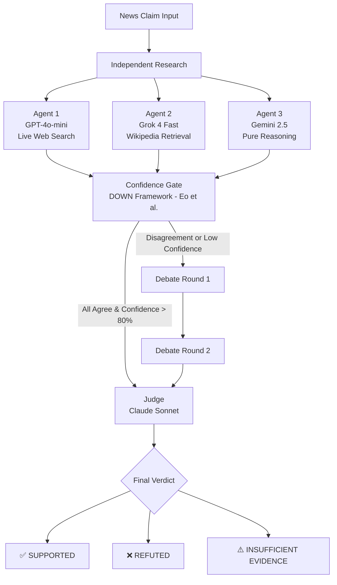

# 🔍 Multi-Agent News Fact Verification System

A production-grade fact verification system powered by Multi-Agent Debate (MAD) using four heterogeneous LLMs that independently research, debate, and verify news claims in real time.

---

## 🧠 How It Works

Three agents independently research a news claim using different tools and models. A confidence gate decides whether debate is needed. If agents disagree, they argue for up to 2 rounds. A judge reads the full debate and delivers the final verdict.
News Claim Input
│
▼
┌─────────────────────────────────────────────────────┐
│  Agent 1 │ GPT-4o-mini    │ Live Web Search          │
│  Agent 2 │ Grok 4 Fast    │ Wikipedia                │
│  Agent 3 │ Gemini 2.5     │ Pure Reasoning (no tools)│
└─────────────────────────────────────────────────────┘
│
▼
Confidence Gate (DOWN paper — Eo et al.)
├── All agree + confidence > 80% → Skip to Judge
└── Disagreement or low confidence → Debate Rounds
│
▼
Debate Round 1 → Debate Round 2
│
▼
Judge │ Claude Sonnet │ Reads full transcript
│
▼
SUPPORTED / REFUTED / INSUFFICIENT_EVIDENCE

---

## 🤖 Agent Design



Architecture Overview
1. Independent Research Phase
  - Three agents investigate the claim using different models and evidence sources.
  - Diversity reduces single-model bias and improves robustness.
2. Confidence Gate
  - Uses the DOWN framework (Eo et al.) to assess agreement and confidence.
  - If all agents agree with high confidence (>80%), the system bypasses debate.
3. Multi-Agent Debate
  - Triggered when agents disagree or confidence is low.
  - Agents challenge each other's evidence and reasoning for up to two rounds.
4. Judge Evaluation
 - Claude Sonnet reviews all research outputs and debate transcripts.
 - Produces the final fact-checking decision.
5. Verdict Categories
 - SUPPORTED — Evidence strongly supports the claim.
 - REFUTED — Evidence contradicts the claim.
 - INSUFFICIENT_EVIDENCE — Available evidence is inconclusive.

Key Benefits
- Multi-source verification
- Cross-model reasoning
- Structured disagreement resolution
- Reduced hallucinations
- Transparent decision-making process
- Evidence-backed final verdicts

---

## 📂 Project Structure
mad-fact-verifier/
├── config.py           # All model names and settings in one place
├── tools.py            # Web search (DuckDuckGo) and Wikipedia functions
├── llm_caller.py       # OpenRouter API communication for all agents
├── debate_graph.py     # LangGraph debate workflow — core of the system
├── load_fever.py       # Downloads claims from climate_fever benchmark
├── evaluate.py         # Runs evaluation and prints accuracy metrics
├── main.py             # Interactive terminal interface
├── claims.json         # Test claims from climate_fever benchmark
├── evaluation_results.json  # Evaluation output for IEEE paper
├── .env.example        # API key template
└── README.md

---

## ⚙️ Setup

### 1. Clone the repository
```bash
git clone https://github.com/farisansari10/mad-fact-verifier.git
cd mad-fact-verifier
```

### 2. Install dependencies
```bash
pip3 install langgraph openai wikipedia ddgs python-dotenv datasets
```

### 3. Create your `.env` file
```bash
cp .env.example .env
```
Open `.env` and add your OpenRouter API key:
OPENROUTER_API_KEY=your-key-here
Get your key at [openrouter.ai](https://openrouter.ai)

### 4. Generate test claims
```bash
python3 load_fever.py
```

---

## 🚀 Usage

### Interactive mode — verify any claim
```bash
python3 main.py
```

### Evaluation mode — benchmark accuracy
```bash
python3 evaluate.py
```
EVALUATION RESULTS
Accuracy          : 53.3%  (8/15)
Avg Confidence    : 0.89
Avg Debate Rounds : 1.0
Total Time        : 4912s

---

## 📊 Evaluation

Evaluated on 15 claims from the [climate_fever](https://huggingface.co/datasets/climate_fever) benchmark dataset — a peer-reviewed dataset of climate science claims with labels SUPPORTED, REFUTED, and INSUFFICIENT_EVIDENCE.

| Metric | Value |
|--------|-------|
| Accuracy | 53.3% (8/15) |
| Avg Confidence | 0.89 |
| Avg Debate Rounds | 1.0 |
| Total Evaluation Time | ~82 minutes |

> Note: climate_fever is a challenging benchmark with nuanced scientific claims. Manual inspection revealed several cases where our system's prediction was arguably more accurate than the dataset's ground truth label — consistent with findings from Xie et al. who showed even GPT-4 struggles on real-world fact verification tasks.

---

## 📚 Research Foundation

This system directly implements concepts from the following papers reviewed in the companion survey (Assignment 2):

| Paper | Concept Implemented |
|-------|---------------------|
| Du et al. (2024) | Foundational multi-agent debate protocol |
| Zhou et al. (2025) A-HMAD | Heterogeneous agents with different models and tools |
| Eo et al. (2025) DOWN | Confidence gate — debate only when necessary |
| Liang et al. (2024) | Judge from different model family to reduce bias |
| Jeong et al. (2026) Tool-MAD | Agents equipped with different external retrieval tools |

---

## 🔧 Configuration

All settings live in `config.py`. To swap a model change it there only — nothing else needs updating.

```python
AGENT1_MODEL = "openai/gpt-4o-mini"
AGENT2_MODEL = "x-ai/grok-4-fast"
AGENT3_MODEL = "google/gemini-2.5-flash"
JUDGE_MODEL  = "anthropic/claude-sonnet-4-5"

MAX_DEBATE_ROUNDS    = 2
CONFIDENCE_THRESHOLD = 0.80
```

---

## ⚠️ Limitations

- No persistent memory between sessions — each claim starts fresh
- Dependent on web search quality — misleading web results affect accuracy
- Climate_fever dataset contains noisy labels on nuanced scientific claims
- Debate rounds increase latency — average 5-6 minutes per claim on evaluation

---

## 🔮 Future Work

- Add persistent memory to avoid re-debating previously verified claims
- Integrate News API and Google Search API for higher quality evidence
- Build a FastAPI backend and web frontend for public access
- Expand evaluation to larger benchmarks like FEVER or LIAR dataset

---

## 👤 Author

**Faris Ansari**
MS Computer Science (FAST)
faris.ansari10@gmail.com

---

## 📄 License

MIT License — free to use, modify, and distribute.